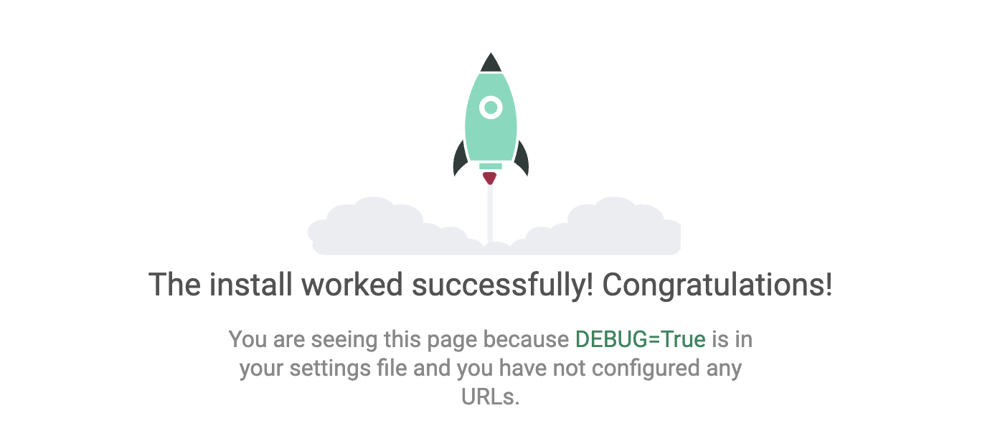

# python_django

## Anacaondaディストリビューションについて

ディストリビューション：プログラミング言語と主なライブラリ類、それらを利用するための環境などを一式パッケージ化したもの

[Anaconda](https://www.anaconda.com/)：Python本体だけでなく、Pythonを利用する各種アプリケーションなどもまとめてインストールし使用できる

## Djangoのインストール

`pip`：pythonに用意されているパッケージ管理ツールコマンド

- pipコマンドを使用：`pip install パッケージ名==バージョン`
  - バージョンを省略すると、公式の最新バージョンがインストールされる

```bash
pip install Django
```

## Djangoのアップデート

- `pip install`に`-U`というオプションを付けて実行すると、最新版のDjangoにパッケージ更新される

```bash
pip install -U django
```

## Djangoプロジェクトを作る

```bash
# djangoプロジェクトの作成
django-admin startproject プロジェクト名
```

## Djangoプロジェクトの中身

| ファイル名 | 概要 |
| :- | :- |
| [\_\_initi\_\_.py](./django_app/django_app/__init__.py) | Djangoプロジェクトを実行するきの初期化処理を行うスクリプトファイル
| [asgi.py](./django_app/django_app/asgi.py) | ASGIという日同時Webアプリケーションのためのプログラム |
| [settings.py](./django_app/django_app/settings.py) | プロジェクトの設定情報を記述したファイル |
| [urls.py](./django_app/django_app/urls.py) | プロジェクトで使うURL(Webでアクセスするときのアドレス)を管理するファイル |
| [wsgi.py](./django_app/django_app/wsgi.py) | WSGIという一般的なWebアプリケーションのプログラム |
| [manage.py](./django_app/manage.py)| プロジェクトで実行するさまざまな機能に関するプログラム|

## Djangoアプリの起動

```bash
# プロジェクトまで移動
cd プロジェクト名
```

```bash
# webアプリケーションの起動
python manage.py runserver
```

[http://localhost:8000](http://localhost:8000)

