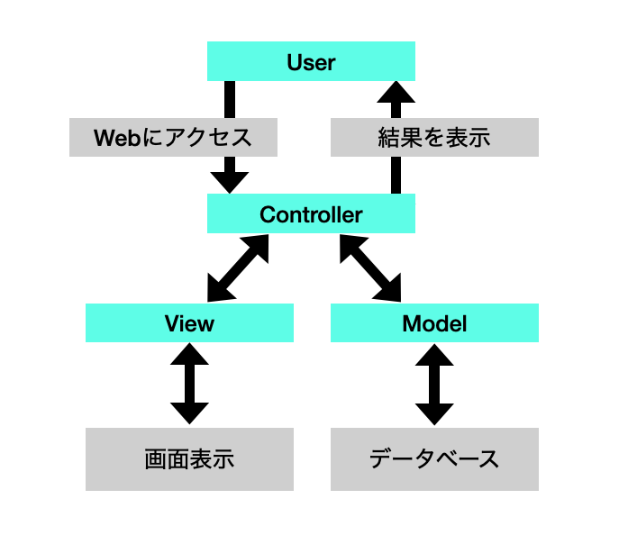

# アプリケーションの作成

## MVCアーキテクチャ

DjangeはMVCアーキテクチャと呼ばれる考え方に基づいて設計されている
| 名称 | 役割 |
| :- | :- |
|  Model<br>(モデル) | データアクセス関係の処理を担当する<br>Webアプリケーションとデータベースのやり取りを担当するもの |
| View<br>(ビュー) | 画面の表示関係を担当する<br>画面に表示されるWebページを作るためのもの |
| Controller<br>(コントローラー) | 全体の制御を担当するもの<br>Webアプリーションで作成する「プログラム」の部分 |



## アプリケーションの追加


Djangoで何か作る場合、プロジェクトにアプリケーションを追加しなければならない

```bash
# Djangoプロジェクト内で実行する
$ python manage.py startapp アプリ名
```

上記コマンドで生成されるフォルダの中身
| 中身 | 役割 |
| :- | :- |
| 「migrations」フォルダ | マイグレーションといって、データベース関係の機能のファイルがまとめらる
| __initi__.py | アプリケーションの初期化処理のためのファイル |
| admin.py | 管理者ツールのためのファイル |
| apps.py | アプリケーション本体の処理をまとめるファイル |
| models.py | モデルに関する処理を記述するファイル |
| tests.py | プログラムのテストに関するファイル |
| views.py | 画面表示に関するファイル |

## ページ表示を書く

### views.pyの作成

```python
from django.shortcuts import render
from django.http import HttpResponse # 追加

# Create your views here

# 関数を定義
def index(request):
    # クライアントに送り返すデータを用意するÏ
    return HttpResponse("Hello Django")

```

### urls.pyの作成

```python
# djangoプロジェクト内のurls.pyを編集
from django.contrib import admin
from django.urls import path, include # 追加

urlpatterns = [
    path('admin/', admin.site.urls),
    path('hello/', include('hello.index')) # 追加
]
```

```python
# helloアプリケーション内にurls.pyを作成
from django.contrib import admin
from django.urls import path

from . import views

urlpatterns = [
    path('', views.index, name='index')
]
```


### webサーバーを起動する

```bash
python manage.py runserver
```

[http://127.0.0.1:8000/hello/](http://127.0.0.1:8000/hello/)にアクセスすると、テキストが表示される

## クエリパラメーターの使用法


アドレスの最後に`?`を付け、その後に`key`と`value`をイコールで繋げて記述する

`http://normaladdress?key=value&key=value・・・`

<details>/
<summary>クエリパラメーター使用例</summary>

```python
# views.pyを編集する
from django.shortcuts import render
from django.http import HttpResponse

# Create your views here.

def index(request):
    # GETの辞書の中に'msg'キーの値があるかどうか確認
    if 'msg' in request.GET:
        # パラメーターの値の取り出し
        msg = request.GET['msg']
        result = 'you typed: "' + msg + '".' 
    else:
        result = ' please send msg parameter!'
    return HttpResponse(result)   
```

[http://127.0.0.1:8000/hello/?msg=hello](http://127.0.0.1:8000/hello/?msg=hello)にアクセスする
</details>

### スマートな値の送り方

urlpatternsの修正で以下のように指定を変更できる

- 分かりにくいアドレス例（`http://〇〇/?id=123&name=jack`）
- スマートなアドレス例（`http://〇〇/123/jack`）

```py
# プロジェクトのurls.pyファイル
from django.contrib import admin
from django.urls import path, include

urlpatterns = [
    path('admin/', admin.site.urls),
    path('hello/', include('hello.urls')),
    path('<int:id>/<nickname>', include('hello.urls')) # 追加
]
```

```py
# アプリのurls.pyファイル
from django.urls import path

from . import views
from . import info # 追加

urlpatterns = [
    path('', views.index, name='index'),
    path('<int:id>/<nickname>/', info.index, name='index') # 追加
]

```

```py
# info.py
from django.shortcuts import render
from django.http import HttpResponse

# Create your views here.


def index(request, id, nickname):
    result = 'your id: ' + str(id) + ', name: ' + nickname + '.'
    return HttpResponse(result)
```

[http://127.0.0.1:8000/hello/123/jack/](http://127.0.0.1:8000/hello/123/jack/)　のようなIDと名前を付けてアクセス可能となる